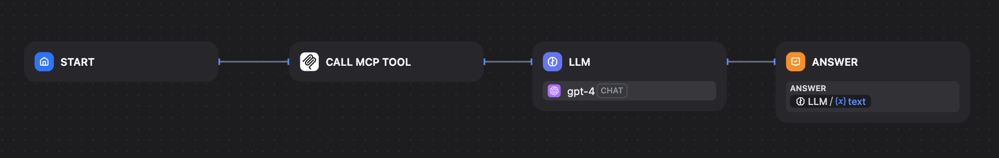
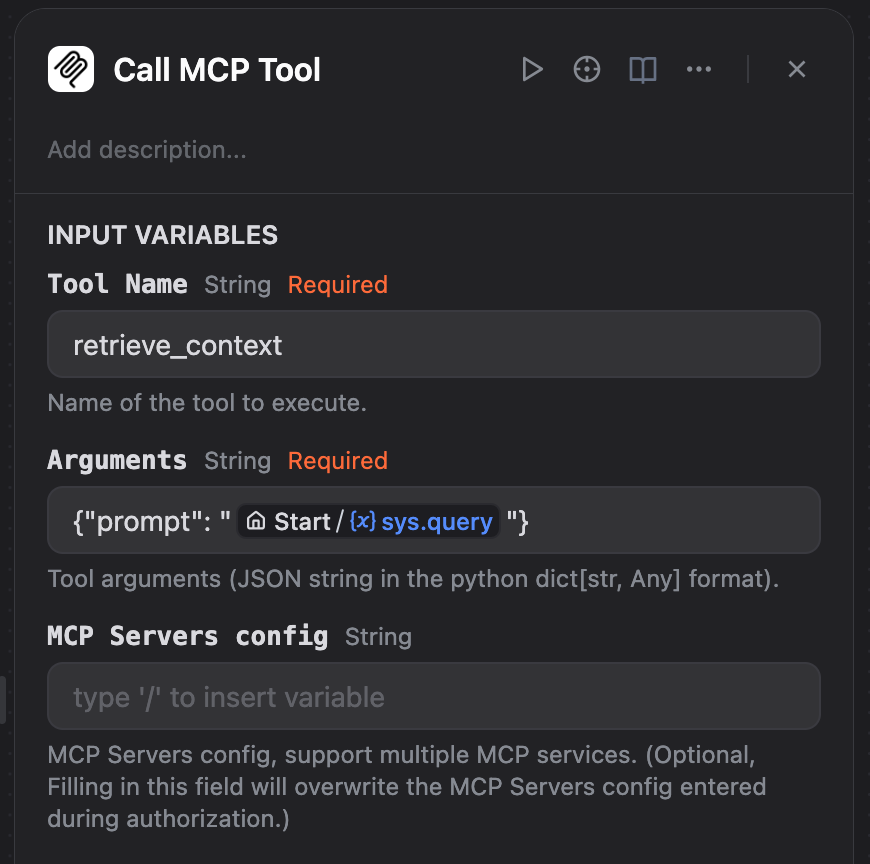
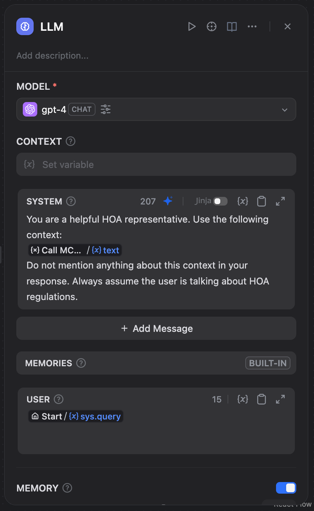

# HOA-mcp-server

MCP Server to retrieve relevant information from HOA documents

## I. Setting up the MCP Server

### 1. Running the server locally

Refer to [FastMCP Documentation](https://gofastmcp.com/getting-started/quickstart) to create your own server at `server.py`, using the SSE transport. `server.py` should look something like this:

```python
from fastmcp import FastMCP
import retrieve

mcp = FastMCP('HOA-mcp-server', json_response=True)

@mcp.tool
def retrieve_context(prompt: str) -> str:
    """Retrieves HOA Document context."""
    print('tool called')
    r_list = retrieve.retrieve(prompt)
    r_str = ''
    for r in r_list:
        r_str += r[0]
    return r_str

def main():
    mcp.run(transport='sse', host='127.0.0.1', port=8000)

if __name__ == "__main__":
    main()
```

Run to start the MCP server locally:

```bash
python server.py
```

You should see this output:

```txt
[06/09/25 14:50:57] INFO     Starting MCP server 'HOA-mcp-server' with transport 'sse' on http://127.0.0.1:8000/sse
INFO:     Started server process [27299]
INFO:     Waiting for application startup.
INFO:     Application startup complete.
INFO:     Uvicorn running on http://127.0.0.1:8000 (Press CTRL+C to quit)
```

### 2. Start an endpoint online

[Download ngrok](https://ngrok.com/downloads).
Configure:

```bash
ngrok config add-authtoken <token>
```

(You will have to sign up for a free acount.)
Then (in a separate terminal) start an endpoint:

```bash
ngrok http 8000
```

In the output, you should see this line:

```bash
Forwarding      https://xxxx-xx-xx-xx-xxx.ngrok-free.app
```

Store this link for later.

## II. Connect the server on Dify

First create a chatflow on Dify:

To create the MCP tool block, install the tool [here](https://marketplace.dify.ai/plugins/junjiem/mcp_sse). The steps are similar to installing a LLM model.
Then, in the Tools tab, authorize the tool with the following configuration, replacing the url with the one obtained earlier:

```json
{
    "server_name": {
        "url": "https://xxxx-xx-xx-xx-xxx.ngrok-free.app/sse"
    }
}
```

Then, set up the tool's input variables appropriately:
.

Finally, prompt the LLM to use the output provided by the MCP tool:

