# Tutorial: HOA MCP Agent in Dify

## Introduction

This guide provides step-by-step instructions for how to run a HOA MCP Agent in Dify, using the "llm_en_v_1_3_1" model.

## Prerequisites

Before starting, ensure you have the following:

1. Dify installed and running via Docker (not running on localhost)
2. Access to a LLM endpoint
3. Model "llm_en_v_1_3_1" accessible from your endpoint

## Step 1: Add LLM Model to Dify

1. Click the user icon located in the top-right corner of the interface
2. Select "Settings" from the dropdown menu
3. Navigate to the "Model Provider" tab
4. Install the "OpenAI-API-compatible" model if not already installed
5. In the "OpenAI-API-compatible" model, click "Add Model" and configure as follows:
   - **Model Type**: LLM
   - **Model Name**: llm_en_v_1_3_1
   - **API Key**: leave blank
   - **API endpoint URL**: `http://<your-server-ip>:5001/openai/v1`
   - **Model context size**: 4096

## Step 2: Set up the MCP Agent

1. At the top of the Dify interface, navigate to the "Tool" tab.
2. Click the "Custom" tab.
3. Click "Create Custom Tool"
4. Set the "Name" field to "Call MCP Tool"
5. Ensure the MCP Server is running. You can start it by entering the following in your terminal:
   ```bash
   python server.py
   ```
6. Set the "Schema" field to the following configuration:

```json
{
  "openapi": "3.0.0",
  "info": {
    "title": "HOA MCP Server",
    "version": "1.0.0",
    "description": "Call various MCP tools via MCP Server"
  },
  "servers": [
    {
      "url": "http://host.docker.internal:8000"
    }
  ],
  "paths": {
    "/mcp/execute": {
      "post": {
        "summary": "Call MCP Tool",
        "description": "Call MCP Tool",
        "operationId": "callTool",
        "parameters": [
          {
            "name": "Accept",
            "in": "header",
            "required": true,
            "description": "Client must accept both application/json and text/event-stream",
            "schema": {
              "type": "string",
              "example": "application/json, text/event-stream"
            }
          }
        ],
        "requestBody": {
          "required": true,
          "content": {
            "application/json": {
              "schema": {
                "type": "object",
                "properties": {
                  "jsonrpc": {
                    "type": "string"
                  },
                  "id": {
                    "type": "integer"
                  },
                  "method": {
                    "type": "string",
                    "enum": [
                      "tools/list", "tools/call"
                    ],
                    "description": "Method to execute"
                  },
                  "params": {
                    "type": "object",
                    "description": "Parameters for the method"
                  }
                },
                "required": [
                  "method"
                ]
              }
            }
          }
        },
        "responses": {
          "200": {
            "description": "Success",
            "content": {
              "application/json": {
                "schema": {
                  "type": "object",
                  "properties": {
                    "result": {
                      "type": "string",
                      "description": "Result of the operation"
                    }
                  }
                }
              },
              "text/event-stream": {
                "schema": {
                  "type": "string",
                  "description": "Server-sent events stream"
                }
              }
            }
          },
          "400": {
            "description": "Bad Request"
          },
          "406": {
            "description": "Not Acceptable - Client must accept both application/json and text/event-stream",
            "content": {
              "application/json": {
                "schema": {
                  "type": "object",
                  "properties": {
                    "error": {
                      "type": "string",
                      "example": "Client must accept both application/json and text/event-stream content types"
                    }
                  }
                }
              }
            }
          },
          "500": {
            "description": "Internal Server Error",
            "content": {
              "application/json": {
                "schema": {
                  "type": "object",
                  "properties": {
                    "error": {
                      "type": "string",
                      "description": "Error message"
                    }
                  }
                }
              }
            }
          }
        }
      }
    }
  }
}
```

7. Click "Save" when you finish.

## Step 3: Integrate the LLM and MCP Agent via Dify

### 1. Start a new application
   - On the main interface, locate the "Create App" box
   - Click "Create from Blank"

### 2. Create a new chatflow
   - On the "Create from Blank" page, select "Chatflow"
   - Enter your app name
   - Click the "Create" button

### 3. Setting up the "Determine Tool" block
   - First disconnect the "LLM" and "Answer" block.
   - Rename "LLM" to "Determine Tool"
   - Input in the "System" field:
     ```
     You are a helpful AI assistant, mainly for answering HOA related questions.
     
     If the user asks about HOA rules, say only "HOA Context."
     If you need to Google search (say, for websites or services), say only "Google Search."
     If the user says anything about updating or adding to the HOA Context, say only "Update Context."
     Otherwise, say only "Other."
     ```

### 4. Add If/Else to determine answer type
   - Right-click on your workflow and select "Add Block"
   - From the menu, choose the "If/Else" block
   - In the "If/Else" block, set up the conditions (type `/` to access variables):
     - **First condition**: (Determine Tool / text) variable contains "HOA Context"
     - Press "+ ELIF", then setup the condition: (Determine Tool / text) variable contains "Google Search"
     - Press "+ ELIF", then setup the condition: (Determine Tool / text) variable contains "Update Context"
    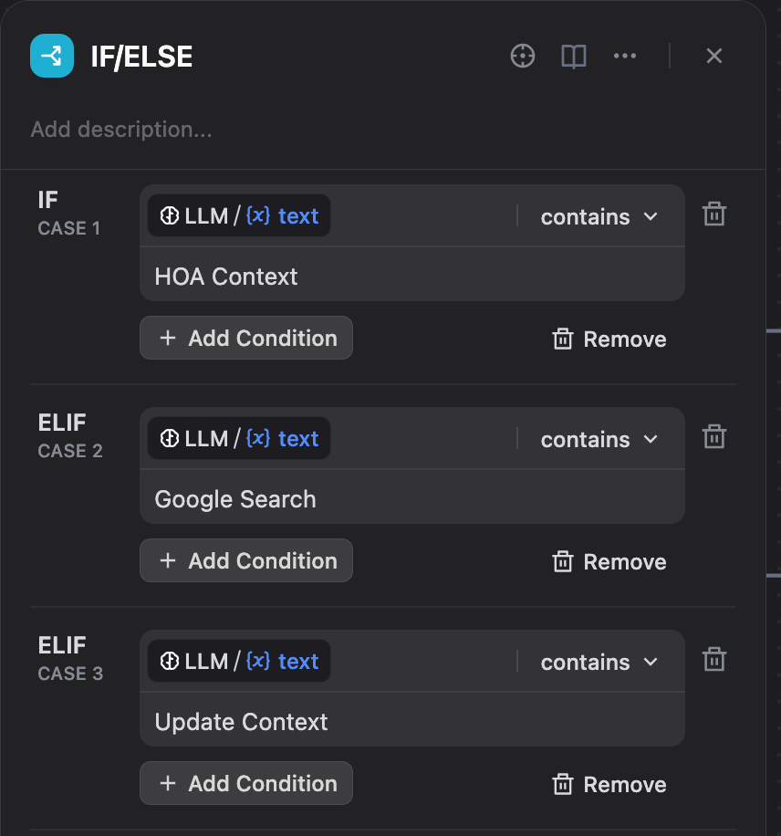
   - Connect the "If/Else" block behind the "Determine Tool" block

### 5. Set up the "HOA Context" case
   - Add block, and select "Call MCP Tool"
   - Rename the block to "Retrieve HOA Context" and connect it to the "IF" of the "If/Else" block.
   - Set up the following configurations (remember, use `/` to access the `sys.query` variable):
     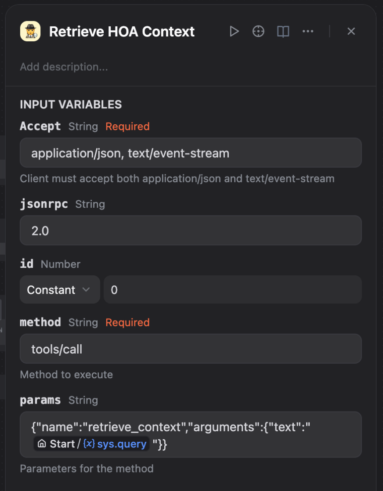
   - Add another "LLM" block and connect it after the "Retrieve HOA Context" block.
   - Rename it to "Use Context" and set "System" to this, except replace the variable with the actual variable in Dify using `/`:
     ```
     You are a helpful HOA representative, designed to help homeowners with their regulations questions. Using the following results from HOA governing documents, answer the user.
     
     <context>
     (Retrieve Context / text) variable
     </context>
     
     Do not mention anything about this context, do not say Based on the provided HOA regulations or anything like that.
     Trust this context over your memory, as the context is the most up-to-date.
     ```
   - Finally, add an "Answer" block and connect it after the "Use Context" block, and set the "Answer" field to the (Use Context / text) variable.

### 6. Set up the "Google Search" case
   - Create a sequence as follows, where "Define Query" is a LLM block, "Google Search" is a "Call MCP Tool" tool, and "Use Search Results" is a LLM block. Attach it to the first ELIF of the "If/Else" block
  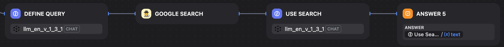
   - Set the "System" field in "Define Query" to this:
     ```
     Given the user's prompt, give a Google search query that would inform you to answer the user. Give me a single query and nothing else, no end line, and no quotation marks either.
     ```
   - Set up the following configurations in the "Google Search" block:
     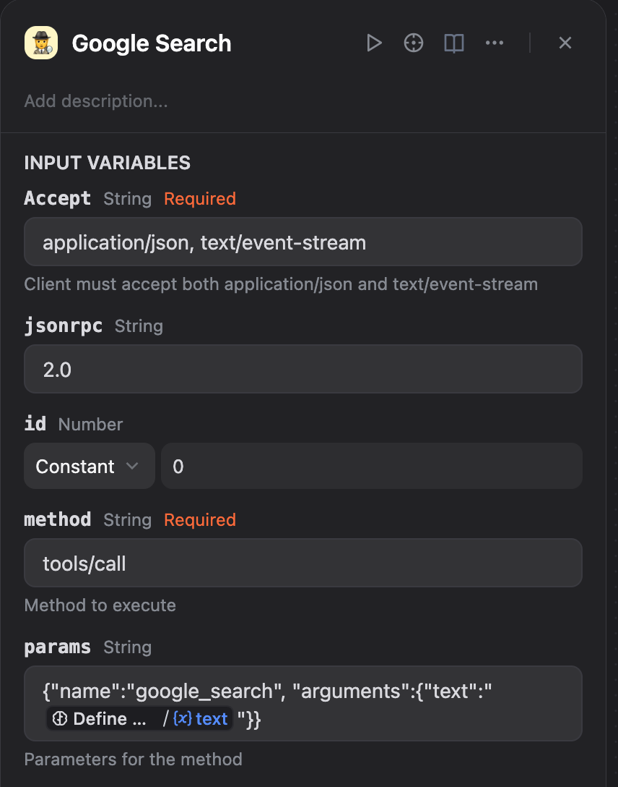
   - Set the "System" field in the "Use Search Results" block to this, except replace the variable with the actual variable in Dify using `/`:
     ```
     Use the following Google Search results to help answer the user's prompt:
     
     <search>
     (Google Search / text) variable
     </search>
     
     Give links for reference where applicable. Do not say based on search results or anything like that.
     ```
   - Set the "Answer" field in the "Answer block" to the (Use Search Results / text) variable.

### 7. Set up the "Update Context" case
   - Create a sequence as follows, where the "If/Else 2" block has the condition `sys.files` is empty, and "Update Context" is a "Call MCP Tool" tool.
    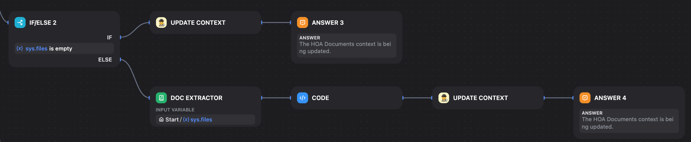
   - Set up the following configurations in the top "Update Context" block:
     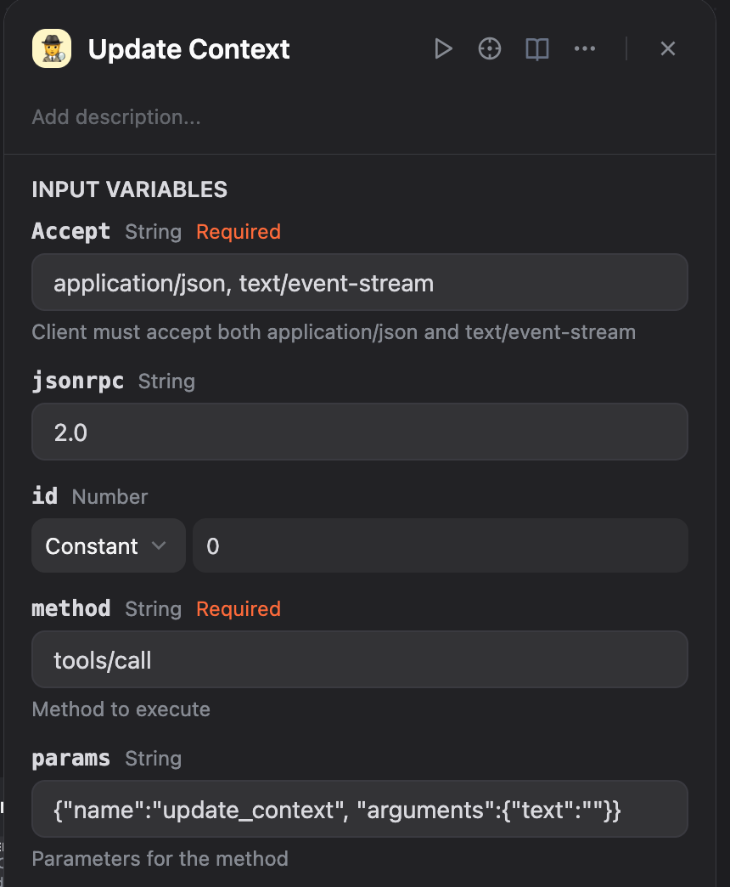
   - Set the "Doc Extractor" block input variable to `sys.files`, and the "Code" block configurations as follows:
     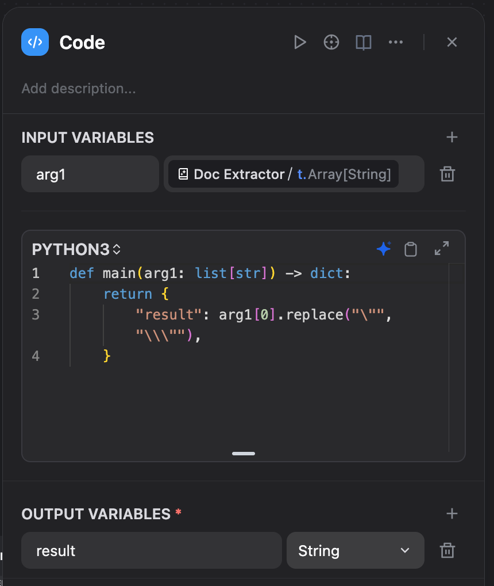
   - In the bottom "Update Context" block, configure it as follows:
     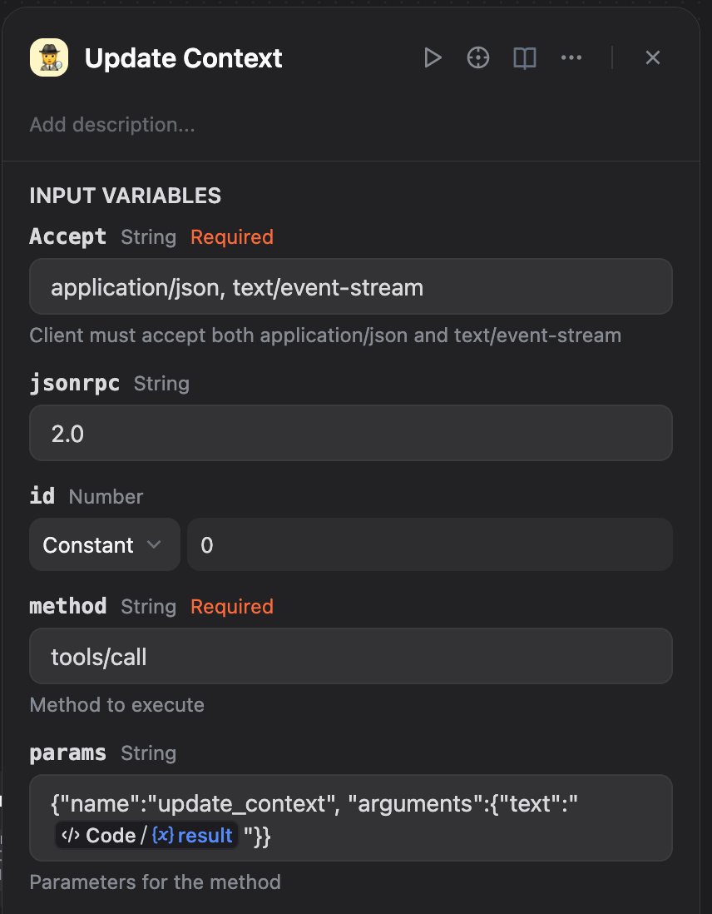
   - Set the "Answer" field in both "Answer" block to this:
     ```
     The HOA Documents context is being updated.
     ```

### 8. Set up the "Other" case
   - Create a sequence as follows, where "Normal" is a LLM. Attach it to the ELSE of the "If/Else" block
   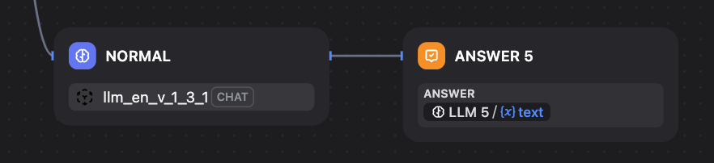
   - Set the "System" field in the "Normal" block to this:
     ```
     Answer the user normally using your existing knowledge.
     ```
   - Set the "Answer" field in the "Answer" block to the (Normal / text) variable.

All in all, your chat flow should look like this:
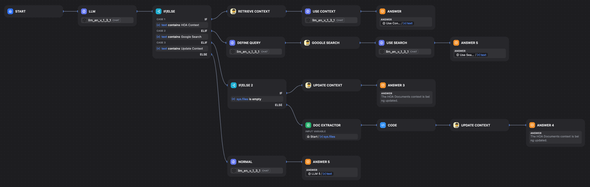

## Step 4: Allow Document Upload

1. Click "Features" in the top right
2. Disable everything, but enable "File Upload"
3. Click on "File Upload" settings, support only "Document" file types, and set "Max number of uploads" to 1.
   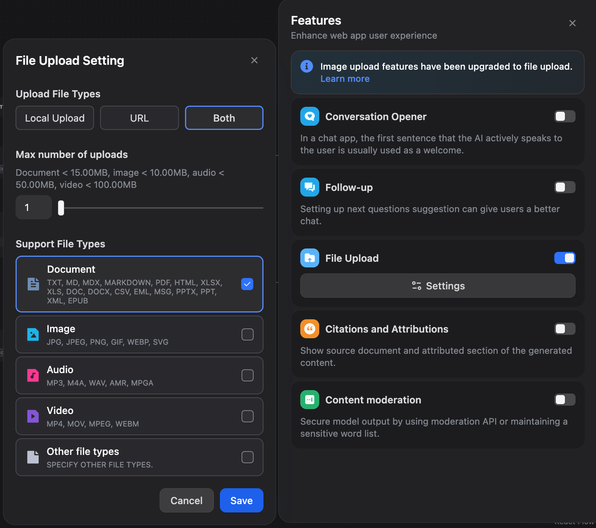